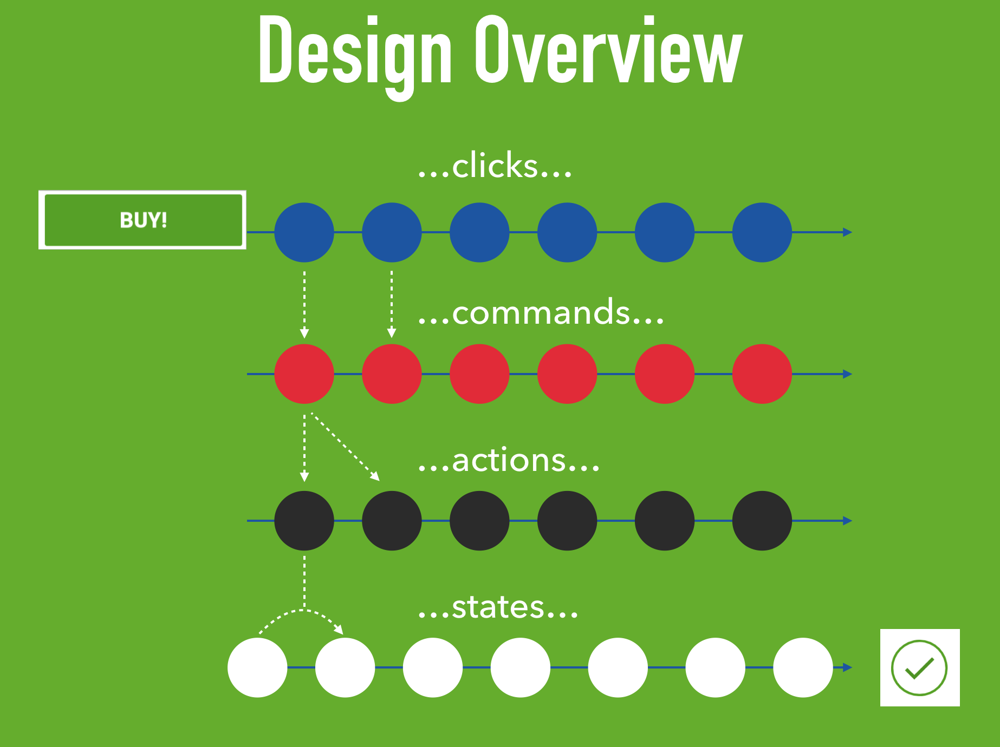

# Grox
Grox helps to maintain the state of Java / Android apps. 

<table style="border:0px">
  <tr  style="border:0px">
    <td width="125" style="border:0px">
       
    </td>
    <td  style="border:0px">
      <a alt="Build Status" href="https://travis-ci.org/groupon/grox">
      </a>
      <br/>
    </td>
  </tr>
</table>

## Understanding Grox



### Video
[](https://youtu.be/RTSJy_MBur0)

We have a [nice video to explain how the Grox sample app works](https://youtu.be/RTSJy_MBur0). 

### Wiki
Visit the [Grox wiki](../../wiki)

### Grox in a nutshell

Grox provides developers with the basic bricks to:
* create a state of a UI / Application
* perform pure changes on this state, 
* be notified of state changes (i.e. to update the UI)
* perform other "side-effects" operations (network calls, manipulating files, etc.)
* log, persist, create an history of states and state changes

## Basic Usage

Very simple example:
```java
//create a store with an initial state
Store<String> store = new Store<>("Hello");
//when the store's state changes, update your UI
states(store).subscribe(System.out::println);
//start dispatching actions to your store...
store.dispatch( oldState -> oldState + " Grox");
```

A command example
```java
public class RefreshResultCommand implements Command {
 @Override
  public Observable<Action> actions() {
    return getResultFromServer() //via retrofit
        .subscribeOn(io())
        .map(ChangeResultAction::new) //convert all your results into actions
        .cast(Action.class)
        .onErrorReturn(ErrorAction::new) //including errors
        .startWith(fromCallable(RefreshAction::new)); //and progress
  }
}

//then use your command via Rx + RxBinding
subscriptions.add(
        clicks(button)
            .map(click -> new RefreshResultCommand())
            .flatMap(Command::actions)
            .subscribe(store::dispatch));
```

Note that such a command should be unsubscribed from when the UI element (e.g. an activity) containing the button `button` will no longer be alive. Otherwise, the Rx chain would leak it.

However, if you preserve your store accross configuration changes (using ViewModels, Dependency Injection (Toothpick/Dagger), retained fragments, etc.), you can also execute commands independently of the lifecycle of the UI:

```java
//then use your command via Rx + RxBinding
subscriptions.add(
        clicks(button)
            .subscribe(click -> new RefreshResultCommand()
                                .actions()
                                .subscribe(store::dispatch)));
```     
In this case, only the outer chain needs to be unsubcribed from when the UI elements are not alive anymore, the inner chain will be preserved during rotation and udpate the store even during a configuration change (e.g. a rotation), and the UI will display the latest when connecting to the store when the rotation is complete. A fine grained management of resources would unsubscribe from the inner chain when the store is not alive anymore.

Browse [Grox sample](grox-sample-rx/src/main/java/com/groupon/grox/sample) for more details.

## Setup

```groovy
    //note that Grox is also available without Rx dependencies
    compile 'com.groupon.grox:grox-core-rx:x.y.z'
    //Grox commands artifacts do depend on Rx (1 or 2)
    compile 'com.groupon.grox:grox-commands-rx:x.y.z'
```

## Main features
The main features of Grox are:
* unify state management. All parts of an app, all screens for instance, can use Grox to unify their handling of state.
* allows time travel debugging, undo, redo, logging, etc. via middlewares.
* simple API. Grox is inspired by Redux & Flux but offers a simpler approach.
* easily integrated with Rx (Rx1 for now, Rx2 will follow soon). Note that it is also possible to use Grox without Rx.
* Grox only relies on a few concepts: States, Actions, Stores, MiddleWare &  Commands (detailed below).
* facilitates using immutable states, but without enforcing it for more flexibility. You can use any solution for immutability ([Auto-Value](https://github.com/google/auto/tree/master/value), [Immutables](https://immutables.github.io/), [Kotlin](https://discuss.kotlinlang.org/t/immutable/1032), etc..) or not use immutability at all if you don't want to.
* Grox can be used with the [Android Arch components](https://developer.android.com/arch), or without them.

## Links
* [Travis CI](https://travis-ci.org/groupon/grox)

## Credits 
The following people have been active contributors to the first version of Grox:
* Shaheen Ghiassy
* Michael Ma
* Matthijs Mullender 
* Turcu Alin
* Samuel Guirado Navarro
* Keith Smyth 
* Stephane Nicolas

## Inspired by
Grox - Java library for state management, inspired by [Flux](http://facebook.github.io/flux/), [Redux](http://redux.js.org/), [Cycle](https://cycle.js.org/), and [Rx Managed State](https://www.youtube.com/watch?v=0IKHxjkgop4).


